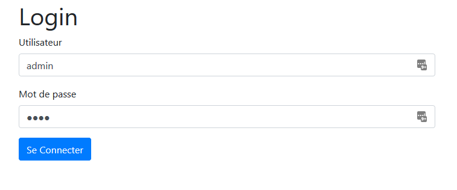
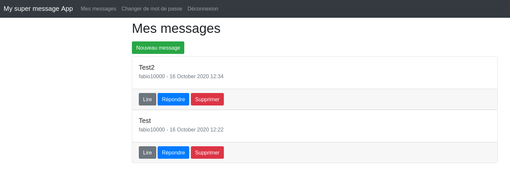
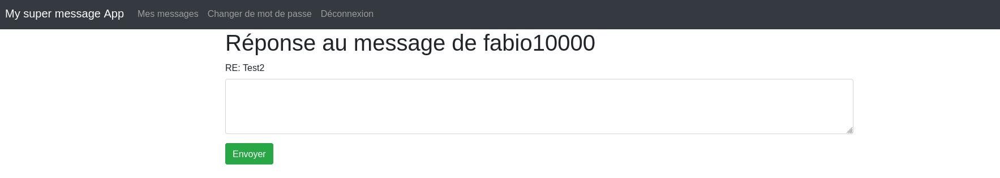
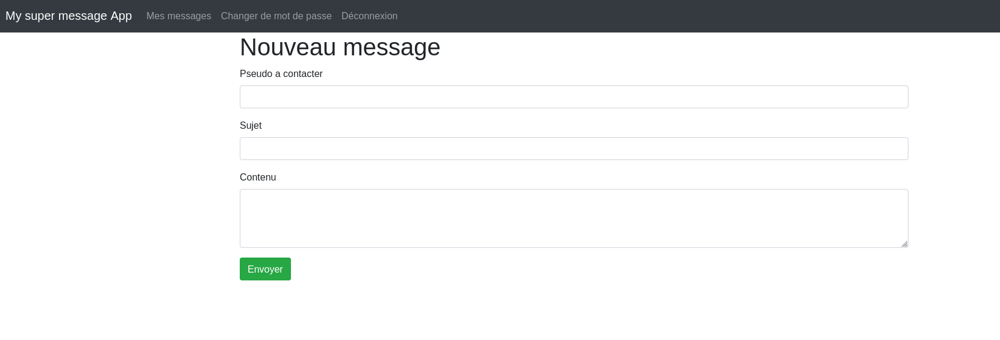
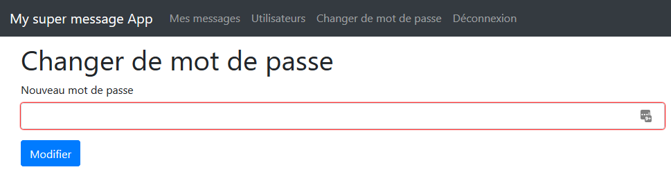
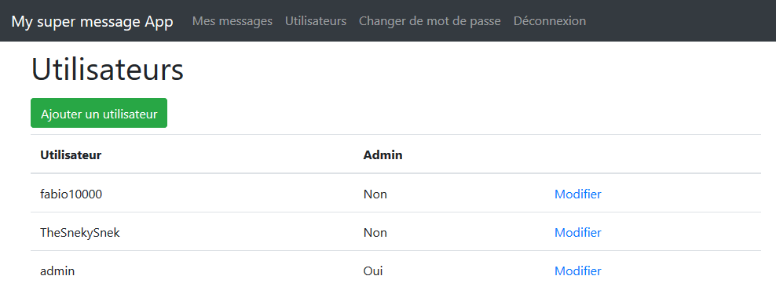
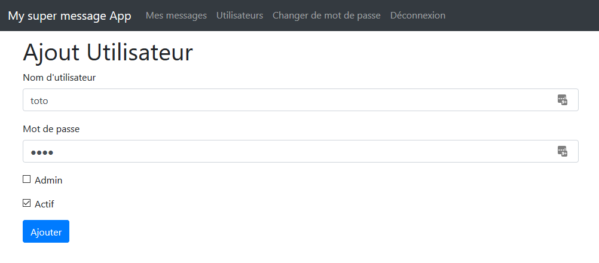
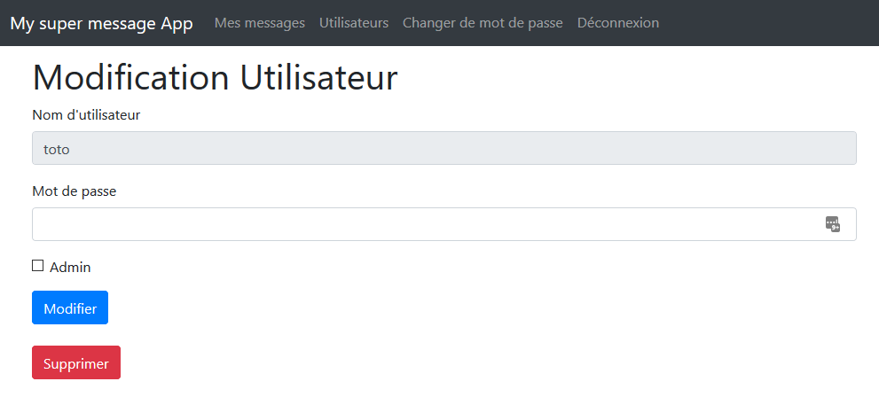

# HEIG-STI-Projet2

## Install
Depuis le répertoire racine du repo, exécuter les commandes suivantes : 
```
# télécharger la container docker et le lancer
docker run -ti -v "$PWD/site":/usr/share/nginx/ -d -p 8080:80 --name sti_project --hostname sti arubinst/sti:project2018

# démarrer le service nginx
docker exec -u root sti_project service nginx start

# démarrer le service php
docker exec -u root sti_project service php5-fpm start
```

Pour finir il faut vérifier que la base de données ainsi que le répertoire `databases` soient modifiable.
`chmod o+w ./site/databases`
`chmod o+w ./site/databases/database.sqlite`

Le mot de passe de phpliteadmin est: **T3y6oY#uccqvIEgu0ly9sMMS**

## Manuel d'utilisation
### Login

Si un utilisateur n'est pas connecté, une page de login lui sera presenté.


Les utilisateurs suivants sont disponibles:
| User  |  Password | Admin  | Actif  |
|---|---|---|---|
| admin | admin1234  | Oui  | Oui  |
| toto | toto1234  | Non  | Oui  |
| tata | tata1234  | Oui  | Non  |

### Voir les messages reçus
Lorsqu'on se connecte, on arrive sur cette page. Il est aussi possible d'y accéder en cliquant sur le lien `Mes messages` dans la barre de navigation.  



### Voir le contenu des messages reçus
Depuis la page `Mes messages` il suffit de cliquer sur le bouton `Lire` du message souhaité 
pour voir le contenu du message


### Répondre a un message
Depuis la page `Mes messages` il suffit de cliquer sur le bouton `Répondre`



### Supprimer un message
Pour supprimer un message il faut aller dans la page `Mes messages` et cliquer sur le bouton `Supprimer` du message souhaité

### Envoyer un message
Pour rédiger un nouveau message il faut tout d'abord aller sur la page `Mes messages` et cliquer sur le bouton `Nouveau message`  

Une fois sur la page `Nouveau message` il faut remplir les différents champs et cliquer sur `Envoyer`



### Modification du mot de passe
L'utilisateur peux changer son mot de passe grace au bouton `Changer de mot de passe` du menu.



### Liste des utilisateurs
Un administrateur a accès à la liste des utilisateurs via le bouton `Utilisateurs` du menu.



### Créer un utilisateur
L'administrateur peut aussi créer un nouvel utilisateur grace au bouton `Ajouter un utilisateur`. L'administrateur renseigne ensuite le nom de l'utilisateur, son mot de passe et si le nouvel utilisateur est administrateur.



### Modifier et supprimer un utilisateur
En selectionant `Modifier` dans la liste des utilisateurs, l'administrateur peut modifier les propriétés d'un utilisateur tel que son mot de passe, si il est administrateur ou peut encore le supprimer.


